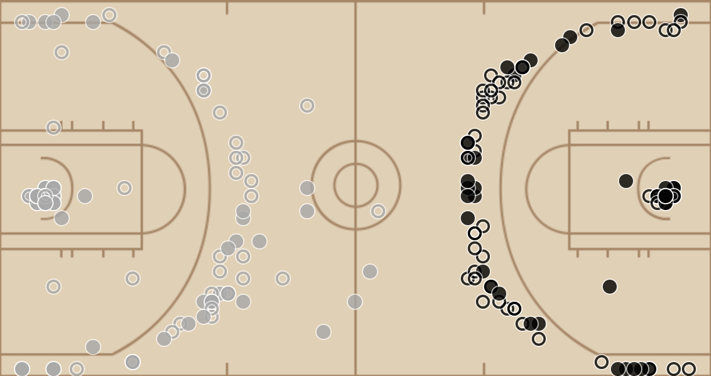
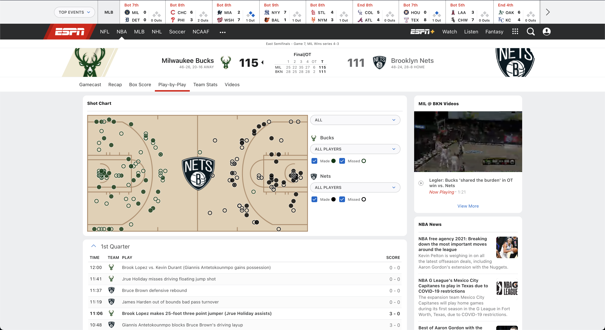

<!--
*** Thanks for checking out the Best-README-Template. If you have a suggestion
*** that would make this better, please fork the repo and create a pull request
*** or simply open an issue with the tag "enhancement".
*** Thanks again! Now go create something AMAZING! :D
***
***
***
*** To avoid retyping too much info. Do a search and replace for the following:
*** bay1877, NBA_ESPN_PlayByPlay_Announcer, bay1877@rit.edu, NBA ESPN Live Play-By-Play Announcer, project_description
-->


<!-- PROJECT SHIELDS -->
<!--
*** I'm using markdown "reference style" links for readability.
*** Reference links are enclosed in brackets [ ] instead of parentheses ( ).
*** See the bottom of this document for the declaration of the reference variables
*** for contributors-url, forks-url, etc. This is an optional, concise syntax you may use.
*** https://www.markdownguide.org/basic-syntax/#reference-style-links
-->
[![Contributors][contributors-shield]][contributors-url]
[![Forks][forks-shield]][forks-url]
[![Stargazers][stars-shield]][stars-url]
[![Issues][issues-shield]][issues-url]
[![MIT License][license-shield]][license-url]
[![LinkedIn][linkedin-shield]][linkedin-url]


<!-- PROJECT LOGO -->
<br />
<p align="center">
  <a href="https://github.com/bay1877/NBA_ESPN_PlayByPlay_Announcer">
    
  </a>
  <h3 align="center">NBA ESPN Live Play-By-Play Announcer</h3>

  <p align="center">
    Announces play by play for a live NBA game using ESPN's Box Score Data
    <br />
    <a href="https://github.com/bay1877/NBA_ESPN_PlayByPlay_Announcer"><strong>Explore the docs »</strong></a>
    <br />
    <br />
    <a href="https://github.com/bay1877/NBA_ESPN_PlayByPlay_Announcer/issues">Report Bug</a>
    ·
    <a href="https://github.com/bay1877/NBA_ESPN_PlayByPlay_Announcer/issues">Request Feature</a>
  </p>
</p>


<!-- TABLE OF CONTENTS -->
<details open="open">
  <summary><h2 style="display: inline-block">Table of Contents</h2></summary>
  <ol>
    <li>
      <a href="#about-the-project">About The Project</a>
      <ul>
        <li><a href="#built-with">Built With</a></li>
      </ul>
    </li>
    <li>
      <a href="#getting-started">Getting Started</a>
      <ul>
        <li><a href="#prerequisites">Prerequisites</a></li>
        <li><a href="#installation">Installation</a></li>
      </ul>
    </li>
    <li><a href="#usage">Usage</a></li>
    <li><a href="#roadmap">Roadmap</a></li>
    <li><a href="#contributing">Contributing</a></li>
    <li><a href="#license">License</a></li>
    <li><a href="#contact">Contact</a></li>
    <li><a href="#acknowledgements">Acknowledgements</a></li>
  </ol>
</details>


<!-- ABOUT THE PROJECT -->
## About The Project

When one does not have access to live sports, when the game is not streamed on live TV, what does one do? This project was born to give a way to keep up with the game without access or attention requirements.

As plays are received by the url request, new plays are detected and read aloud. New quarters are also detected.

Note: Up to the last 15 plays will be read when starting the script for an existing game. After that, plays are read as they come in through the request.

### Built With

* [pyttsx3](https://pypi.org/project/pyttsx3/)
* [BeautifulSoup](https://pypi.org/project/beautifulsoup4/)
* [requests](https://pypi.org/project/requests/)

<!-- GETTING STARTED -->
## Getting Started

To get a local copy up and running follow these simple steps.

### Prerequisites

This project assumes you have python installed.

### Installation

1. Clone the repo
   ```sh
   git clone https://github.com/bay1877/NBA_ESPN_PlayByPlay_Announcer.git
   ```
2. Enter the repo directory
   ```sh
   cd NBA_ESPN_PlayByPlay_Announcer
   ```
2. Setup and enter the virtual environment.
   ```sh
   python3 -m venv venv
   source ./venv/bin/activate
   ```
3. Install Python packages
   ```sh
   pip install -r requirements.txt
   ```

### MP3 Players
Different operating systems use different command line mp3/audio players. The code currently supports MacOS.

##### Mac OS
Use `afplay`.

##### Linux
Try `mpg123`.

##### Windows
Use linux.

<!-- USAGE EXAMPLES -->
## Usage

|  |
|:---:|
| *The above capture was taken from the following game: [https://www.espn.com/nba/playbyplay/_/gameId/401332963](https://www.espn.com/nba/playbyplay/_/gameId/401332963).* |

For the game you want to listen to, select the gamecast for a live game, and then select *Play-by-Play*. This is the link that you will pass into the script as a runtime argument. It should be in the following format where *n* is the unique game Id given by ESPN.
```
https://www.espn.com/nba/playbyplay/_/gameId/n
```

Also note the current quarter of the game.

With the link and the current quarter, run the script with the below.
```
python run.py <espn play by play url> <quarter #>
```

<!-- ROADMAP -->
## Roadmap

See the [open issues](https://github.com/bay1877/NBA_ESPN_PlayByPlay_Announcer/issues) for a list of proposed features (and known issues).

<!-- CONTRIBUTING -->
## Contributing

Contributions are what make the open source community such an amazing place to learn, inspire, and create. Any contributions you make are **greatly appreciated**.

1. Fork the Project
2. Create your Feature Branch (`git checkout -b feature/AmazingFeature`)
3. Commit your Changes (`git commit -m 'Add some AmazingFeature'`)
4. Push to the Branch (`git push origin feature/AmazingFeature`)
5. Open a Pull Request


<!-- LICENSE -->
## License

Distributed under the MIT License. See `LICENSE` for more information.


<!-- CONTACT -->
## Contact

Bradley Yoder  - bay1877@rit.edu

Project Link: [https://github.com/bay1877/NBA_ESPN_PlayByPlay_Announcer](https://github.com/bay1877/NBA_ESPN_PlayByPlay_Announcer)


<!-- ACKNOWLEDGEMENTS -->
## Acknowledgements

* []()
* []()
* []()


<!-- MARKDOWN LINKS & IMAGES -->
<!-- https://www.markdownguide.org/basic-syntax/#reference-style-links -->
[contributors-shield]: https://img.shields.io/github/contributors/bay1877/NBA_ESPN_PlayByPlay_Announcer?style=for-the-badge
[contributors-url]: https://github.com/bay1877/NBA_ESPN_PlayByPlay_Announcer/graphs/contributors
[forks-shield]: https://img.shields.io/github/forks/bay1877/NBA_ESPN_PlayByPlay_Announcer?style=for-the-badge
[forks-url]: https://github.com/bay1877/NBA_ESPN_PlayByPlay_Announcer/network/members
[stars-shield]: https://img.shields.io/github/stars/bay1877/NBA_ESPN_PlayByPlay_Announcer?style=for-the-badge
[stars-url]: https://github.com/bay1877/NBA_ESPN_PlayByPlay_Announcer/stargazers
[issues-shield]: https://img.shields.io/github/issues/bay1877/NBA_ESPN_PlayByPlay_Announcer?style=for-the-badge
[issues-url]: https://github.com/bay1877/NBA_ESPN_PlayByPlay_Announcer/issues
[license-shield]: https://img.shields.io/github/license/bay1877/NBA_ESPN_PlayByPlay_Announcer?style=for-the-badge
[license-url]: https://github.com/bay1877/NBA_ESPN_PlayByPlay_Announcer/blob/master/LICENSE.txt
[linkedin-shield]: https://img.shields.io/badge/-LinkedIn-black.svg?style=for-the-badge&logo=linkedin&colorB=555
[linkedin-url]: https://linkedin.com/in/bay1877
